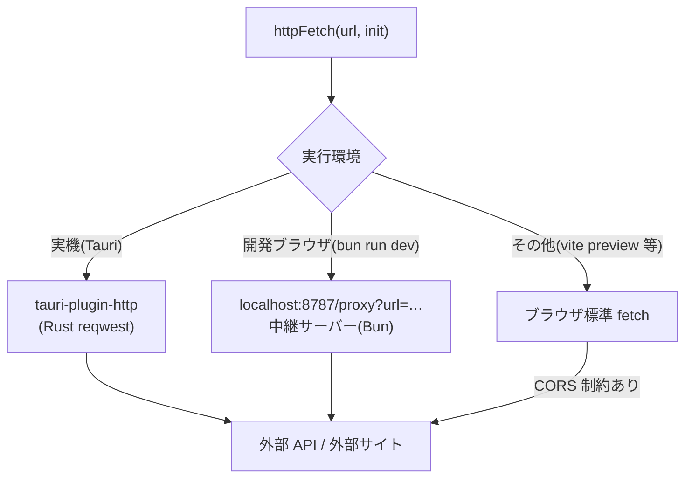

# HTTP 通信経路仕様(CORS 回避を含む)

外部 API への HTTP リクエストは、実行環境によって経路が異なる。
分岐は `src/shared/lib/httpClient.ts` の `httpFetch` に集約されている。
外部サイトの HTML 取得(→ [ui/screens.md](../ui/screens.md))も
同じ `httpFetch` を使う。`httpFetch` はリダイレクト追跡後の最終 URL を
`Response.url` として引き継ぐ。

## 経路一覧

| 実行環境 | 経路 | CORS |
|---|---|---|
| 実機(Tauri) | `@tauri-apps/plugin-http`(Rust の reqwest から送信) | 制約を受けない |
| 開発時(ブラウザ, `bun run dev`) | `http://localhost:8787/proxy?url=<本来のURL>` の中継サーバー経由 | 中継サーバーが回避 |
| その他(vite preview 等) | ブラウザ標準 fetch(フォールバック) | 制約を受ける |

## 実機(Tauri)

- WebKitGTK の CORS 制約を避けるため、`tauri-plugin-http` の fetch を使う。
  サーバーが `Access-Control-Allow-Origin` を返さなくても疎通できる。
- capability(`src-tauri/capabilities/default.json`)の許可 URL は
  `http://*:*` / `https://*:*`(任意ホスト・任意ポート)。
  かつては `https://*.chibatech.ac.jp/*` に限定していたが、外部サイト
  (`externalSites`。設定でいつでも変更できる任意 URL)を同じ経路で取得する
  仕様になったため撤廃した。パターンは URLPattern 形式で、ポート既定値の
  URL(ポート表記なし)にも `*` はマッチする。

## 開発時ブラウザ(中継サーバー)

`bun run dev`(`scripts/dev.ts`)が Vite と同時に中継サーバー(既定ポート 8787、
環境変数 `DEV_PROXY_PORT` で変更可)を起動する。

- フロントは常に `http://localhost:8787/proxy?url=<encodeURIComponent(本来のURL)>` へ
  リクエストし、中継サーバーがサーバーサイド fetch で転送する。
- メソッド・ボディ(GET/HEAD 以外は生バイト列をそのまま)・ヘッダーを引き継ぐ。
  ただし `host` / `origin` / `referer` / `connection` / `content-length` は転送前に除去。
- OPTIONS プリフライトには 204 + CORS 許可ヘッダーで応答する。
  許可ヘッダーは `Access-Control-Request-Headers` の要求値をそのまま反映する
  (外部サイト設定の任意 HTTP ヘッダー(X-Api-Key 等)を通すため。要求が無い
  場合の既定は `Authorization, Content-Type, Accept`)。
- 転送先の最終 URL(リダイレクト追跡後)を `X-Final-Url` ヘッダーで返す
  (`Access-Control-Expose-Headers` で公開)。外部サイト表示が
  相対 URL の解決基準として使う。
- 転送失敗時は 502 でエラーメッセージを返す。
- ポート番号はフロント(`httpClient.ts` の `DEV_PROXY_PORT`)と一致させること。
  `scripts/dev.ts` が `DEV_PROXY_PORT` をVite公開変数へ引き継ぐため、環境変数で変更しても
  両者は同じ値になる。中継はlocalhostだけで待ち受け、HTTP(S)以外へは転送しない。

## Socket.IO(在室状況の更新通知)

socket.io-client はブラウザの WebSocket を使うため中継しない。実機・開発時とも
設定のエンドポイントへ直接接続する。

**トランスポートは WebSocket に固定**している(`transports: ["websocket"]`)。
Socket.IO 既定の HTTP ロングポーリングによるハンドシェイクは、実機
(WebKitGTK + カスタムスキーム)では CORS で拒否されるため。WebSocket の
アップグレード要求はブラウザの CORS 制約を受けない。
