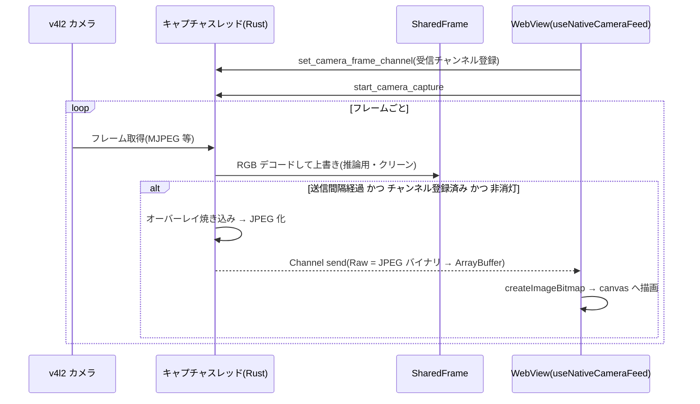

# カメラキャプチャ仕様

## 背景

Linux 版 Tauri(WebKitGTK)の getUserMedia() は、PipeWire 未整備のミニマルな
startx キオスク環境では動作しない。そのため実機では **Rust 側が v4l2 を直接叩いて**
フレームを取得し、フロントへは Tauri Channel で JPEG バイナリを渡す。

開発時にブラウザ単体で開いた場合のみ getUserMedia(`useCamera`)を使う。

## キャプチャスレッド(`src-tauri/src/camera_capture.rs`)

- `start_camera_capture` コマンドで開始、`stop_camera_capture` で停止。
  多重起動は防止され、先に動いているスレッドがあれば何もしない。
- 停止時はカメラ解放(スレッド終了)まで待ってから戻る(次回起動時の
  「デバイス使用中」エラー防止)。start/stop とも async コマンドとして
  ブロッキングスレッドで実行され、v4l2 がハングしても UI(メインスレッド)は
  巻き込まれない。
- `set_camera_stream_paused` で画面消灯中のフロント配信を一時停止できる。
  停止中はカメラを掴んだままフレーム取得を続け、JPEG 化・送信を止めて
  デコードも 0.5 秒間隔に間引く(人感復帰用の SharedFrame 鮮度は維持)。
  → [system/kiosk-operations.md](../system/kiosk-operations.md)

### デバイス選択とフォーマット交渉

1. nokhwa で全カメラを列挙(/dev/video0 決め打ちにしない)。
2. **フレームレートの正規化**: nokhwa の Linux バックエンドは、デバイスの
   現在のフレーム間隔の分子が 1 でないと
   「Could not get device property V4L2 FrameRate: Framerate not whole number」
   で開けない。UVC カメラ(iMac の FaceTime HD 等)は 29.97fps(1001/30000)や
   100ns 単位の生値(333333/10000000)のような分数で報告することがあるため、
   開く前に v4l2 の S_PARM で整数 fps(現在値に最も近い整数 → デバイスが
   列挙する離散インターバル由来の整数の順に試行)へ正規化し、G_PARM で
   分子 1 になったことを確認する。
3. 各デバイスについて次の順で開くことを試みる:
   MJPEG → YUYV → NV12 → 最高解像度(フォーマット不問)。
   要求解像度は 640x480@30fps(`CAPTURE_WIDTH` / `CAPTURE_HEIGHT`)。
4. さらに v4l2 の G_FMT / G_PARM で「デバイスが今出しているフォーマット」を照会し、
   完全一致の Exact 要求を最後の候補に足す。フォーマット列挙に正しく応答しない
   v4l2loopback(仮想カメラ)対策。
5. どの候補でも開けず、現在の出力が未対応フォーマットの場合は、フィーダー側の
   設定変更を促すエラーメッセージを返す。

### キャプチャループ

- ウォームアップ: 最初の 8 フレーム(`WARMUP_FRAMES`)は捨てる(自動露出の安定待ち)。
- カメラ取得・デコードと `SharedFrame` の上書きはデバイスのフレームペースで継続する。
- 表示用RGBコピー・JPEG(品質は `cameraJpegQuality`、既定75)・Channel送信だけを
  `cameraFrameIntervalMs`(既定100ms = 10fps)で間引く。このため表示FPSを下げても
  推論用フレームや消灯中の人感検出の鮮度は下がらない。受信チャンネルが未登録の
  間は表示用の処理自体を省く。
- 設定はキャプチャ開始時に読み、以降も 2 秒間隔で読み直す。送信間隔(fps)・JPEG 品質の
  変更は、カメラを掴み直さず(映像を途切れさせず)に数秒で反映される。端末の再起動を待たない。
- エラー耐性: 単発のフレーム取得失敗は握りつぶし、15 回(`MAX_CONSECUTIVE_ERRORS`)
  連続で失敗したときだけ `camera-error` を emit して終了する(無人運用での復帰性重視)。

## フロントへの配信方式(Tauri Channel / バイナリ)

- フロントは `set_camera_frame_channel` コマンドで受信チャンネルを登録する
  (ブートチェックのカメラ診断と本画面の `useNativeCameraFeed` がそれぞれ登録し、
  後から登録した方で上書きされる)。キャプチャの開始・停止とは独立している。
- 表示フレームは JPEG 化した `Vec<u8>` を Channel へ **バイナリ(Raw)のまま**送る。
  1KB を超えるペイロードは Tauri の IPC カスタムプロトコル(fetch)経由で
  WebView に ArrayBuffer として届く。旧方式(base64 文字列の `camera-frame`
  イベント)はフレームごとに base64 エンコード(Rust)→ JSON 文字列化 →
  base64 デコード(WebView)が走り CPU 負荷・転送量が大きかったため廃止した。
- エラー通知(`camera-error`)は低頻度のため従来どおりイベントで送る。

## フロント側の表示(`useNativeCameraFeed`)

- Channel で届いた ArrayBuffer を `createImageBitmap()`(JPEG Blob)でデコードし、
  `<canvas>` へ `drawImage` で描画する。描画準備が完了したビットマップを一括で
  転送するため、旧 `` 方式で必要だったダブルバッファ(点滅対策)は不要。
- デコードが届くペースより遅い場合は「最後に届いたフレームだけ」を適用し、
  古いフレームが積み上がらないようにする。
- `camera-error` 受信でエラー表示に切り替える。
- 致命的な取得エラーでスレッドが終了した場合は5秒後に停止・開始を直列に行い、
  カメラの差し直しや一時障害から自動復旧する。初回の開始失敗時も同じ
  リトライが働く。

## 推論との関係

推論(顔認証・ジェスチャー)は `SharedFrame` から直接読むため、フロントへの
配信頻度・品質(上記設定)は **推論精度に影響しない**。フレームが 3 秒より古い場合、
推論側は「カメラ映像なし」としてエラーを返す。
