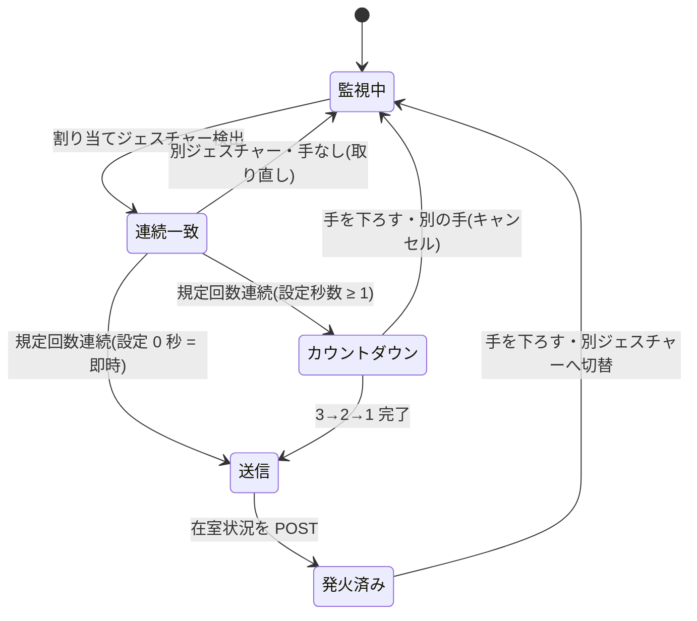

# ジェスチャー操作仕様

## 概要

カメラに向けた手の形(グー / チョキ / パー)を認識し、設定されたマッピングに
従って在室ステータスを自動で更新する。タップ操作の代替手段で、次の2箇所で動作する
(共通ロジックは `features/gesture/useGestureStatusLoop`)。

1. **顔認証の確認カード(「◯◯さんですか?」)表示中** — 認識された本人が
   「はい」を押さずにジェスチャーをかざすと、その割り当てステータスで直接記録される。
   また**サムズダウン(👎)で「ちがう」**を選んで非接触で否認できる
   (設定 `rejectGesture`、無効化も可)。カード下部に案内(ガイド)を表示する。
   マウス/タッチでの「はい」→シート操作と合わせて、**接触・非接触の両経路**で
   更新が完結する。
2. **在室ステータス操作シート表示中** — メンバーカードのタップで開いた場合
   (顔認証で特定されていない人を含む)もジェスチャーで更新できる。
   シート下部に案内を表示する。

ジェスチャーの表示は絵文字ではなく専用 SVG アイコン
(`GestureRockIcon` / `GestureScissorsIcon` / `GesturePaperIcon`)を使う。
案内 UI は共通コンポーネント `features/gesture/GestureGuide`(割り当て済みの
ジェスチャーのみ表示・検出中はハイライト)。

## 認識パイプライン(Rust 側 / `detect_gesture`)

1. `SharedFrame` から最新フレームを取得(3秒より古ければエラー)。
2. **手のひら検出** — palm_detection_mediapipe(OpenCV Zoo 変換版)。
3. **手指ランドマーク推定** — handpose_estimation_mediapipe。
4. 指の屈伸状態からジェスチャーを分類:
   `Rock` / `Scissors` / `Paper` / `ThumbsUp` / `ThumbsDown` / `Unknown`。
   分類は21点ランドマークからの**ルールベース**(追加のMLモデル不要)。
   形の判定は回転補正後のクロップ座標(回転不変)で行い、サムズアップ/ダウンの
   上下だけは回転補正の影響を受けない**元フレーム座標**で判定する
   (親指のみ伸展 + 親指先が手首より手のサイズ比25%以上 上/下)。
5. 設定ストア(settings.json)の `gestureStatusMap` を参照し、ジェスチャーに
   割り当てられた在室ステータス(`roomStatus`)を付けて返す。空文字の割り当ては
   「そのジェスチャーでは更新しない」を意味し `null` を返す。
   `ThumbsUp` / `ThumbsDown` は確認用アクションのためステータスには割り当てず、
   常に `roomStatus: null`。

## レスポンス(`GestureResult`)

```ts
{
  handDetected: boolean;
  gesture: "Rock" | "Scissors" | "Paper" | "ThumbsUp" | "ThumbsDown" | "Unknown";
  confidence: number;
  roomStatus: string | null;  // gestureStatusMap 適用結果
}
```

## フロント側ループ(`useGestureStatusLoop`)



- 対象画面の表示中のみ `gesturePollIntervalMs`(既定 700ms)間隔でポーリング。
- **連続一致ガード**: 同じジェスチャーが `gestureStableCount`(既定 2)回連続した
  ときだけステータス更新を確定する(誤爆防止)。**0 は無制限**(いくら連続しても
  確定しない = ジェスチャー操作の無効化)。
- **送信前カウントダウン**: 確定後すぐには送信せず、設定
  `gestureCountdownSeconds`(既定 3 秒、0 で即時送信)のカウントダウン
  (3→2→1、進捗リング+数字のアニメーション表示 = `GestureCountdown`)を挟む。
  カウント中に手を下ろす・別のジェスチャーへ変えるとキャンセルされる
  (検出の一時的なちらつき1回は許容)。「ちがう」(サムズダウン)はカードを
  閉じるだけの操作のためカウントダウンを挟まず即時発火する。
- **再発火の抑止と切り替え**: 発火後に同じ手を出し続けてもPOSTを繰り返さない。
  手を下ろす/Unknown になるか、**別のジェスチャーへ切り替えた**時点で判定を
  再開する(手を下ろさずにグー→チョキと変えれば連続で操作できる)。
  この発火済み状態は**操作セッション(確認カード・操作シートの表示)ごとに
  リセット**される。ループ停止中(カードが閉じている間)に手を下ろしても
  観測できないため、持ち越すと同じジェスチャーが二度と送信されなくなる。
- **呼び出し側の注意**: 送信(POST)中も `active` を維持し、多重実行は
  コールバック側のガードで弾くこと。送信のたびに active を落とすとループが
  再起動して発火済みガードが外れ、同じ手を出し続けているだけで再送になる。
- 発火時は在室状況更新 API(→ [api/external-api.md](../api/external-api.md))を呼び、
  成功したらローカルの一覧表示も即時更新する(成功音 / 失敗音も再生)。
- 現在のステータスと同じ値への更新は確定しない(カウントダウンも始めない)。
  ガイド(GestureGuide)では現在と同じステータスに割り当てられたジェスチャーを
  淡色(使用不可)で表示する。

## マッピング設定

設定画面「ジェスチャー」セクションで、各ジェスチャーに在室 / 外出 / 帰宅 / なし を
割り当てる。既定値:

| ジェスチャー | 既定ステータス |
|---|---|
| グー | 在室 |
| チョキ | 外出 |
| パー | 帰宅 |

キー名(rock / scissors / paper)と既定値はフロント(useSettings.ts)と
Rust(vision/mod.rs)で揃えること。設定画面での割り当てはボタン選択式
(ダークテーマで見づらいプルダウンは使わない)。

## 操作ガイド表示(`GestureGuide`)

確認カード・操作シートの下部に、ステータスが割り当てられているジェスチャーだけを
アイコン+ステータス名で表示する。検出中のジェスチャーはハイライトされる。
割り当てが1つも無い場合は何も表示しない。
