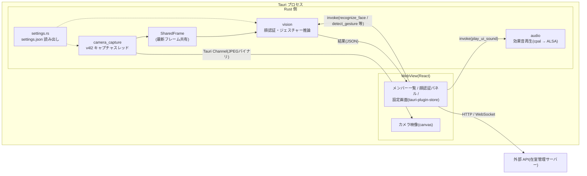

# アーキテクチャ概要

## アプリケーションの目的

研究室の入口などに設置するキオスク端末で、メンバーの在室状況(在室 / 外出 / 帰宅)を
表示・更新するアプリケーション。更新手段として以下の3つを提供する。

1. **タップ操作** — メンバーカードをタップしてステータスを選択
2. **顔認証** — カメラに顔を向けると本人を特定し、確認後にステータス操作へ進む
3. **ジェスチャー** — ステータス選択画面で手の形(グー/チョキ/パー)を見せると自動選択

## 技術スタック

| レイヤ | 技術 |
|---|---|
| デスクトップシェル | Tauri v2(Linux / WebKitGTK、deb 配布) |
| フロントエンド | React 19 + TypeScript + Tailwind CSS v4 + Vite |
| ランタイム(開発) | Bun(`bun run dev` で Vite + CORS 中継サーバーを起動) |
| バックエンド(推論) | Rust + ONNX Runtime(load-dynamic) |
| 顔認証モデル | InsightFace buffalo_l(SCRFD det_10g / 2d106det / ArcFace w600k_r50) |
| ジェスチャーモデル | MediaPipe 変換モデル(palm_detection / handpose_estimation) |
| カメラ | nokhwa + v4l2 直接キャプチャ(getUserMedia 非依存) |
| 設定永続化 | tauri-plugin-store(settings.json) |
| HTTP | tauri-plugin-http(実機)/ ブラウザ fetch + 中継サーバー(開発時) |

## プロセス・データフロー



- **推論はすべて Rust 側で完結**する。フロントは `invoke` で結果(JSON)を受け取るだけ。
- カメラフレームはキャプチャスレッドが `SharedFrame`(Mutex)へ常に最新を上書きし、
  推論はフロントの表示ペースと独立に「その時点の最新フレーム」を読む。
- フロントへの映像は JPEG バイナリのまま Tauri Channel で送る(表示専用)。
  base64 文字列イベントだった旧方式に比べ、エンコード/デコードの二重コストが無い。

## ディレクトリ構成(主要部)

```
src/                       フロントエンド(Feature-Sliced Design 風)
  app/                     エントリ・プロバイダ・グローバルCSS
  entities/member/         メンバーのモデル・API・Context
  features/                face-auth / kiosk-socket / screen-dimmer
  shared/                  hooks(useSettings 等)・lib(httpClient 等)・ui
  widgets/                 画面を構成する大きめの部品(パネル・設定ページ等)
src-tauri/
  src/lib.rs               Tauri コマンド登録・システム系コマンド
  src/camera_capture.rs    v4l2 キャプチャスレッド
  src/settings.rs          settings.json のRust側読み出し
  src/vision/              推論(face / gesture / runtime / paths / geometry)
  resources/models/        ONNX モデル(deb に同梱)
scripts/dev.ts             開発用: CORS 中継サーバー + Vite 起動
docs/                      本仕様書
```

## 実行モード

| モード | 起動方法 | カメラ | 推論 | HTTP |
|---|---|---|---|---|
| 実機(キオスク) | deb インストール後 startx で起動 | v4l2(Rust) | あり | tauri-plugin-http |
| 開発(Tauri) | `bun run tauri dev` | v4l2(Rust) | あり | tauri-plugin-http |
| 開発(ブラウザ) | `bun run dev` → localhost:1420 | getUserMedia | なし(UI のみ) | 中継サーバー経由 |
