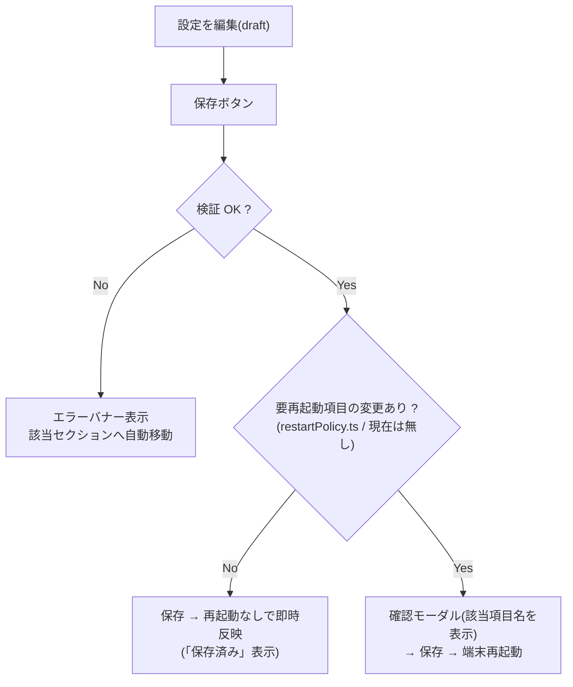

# 設定仕様

## 保存方式

- `tauri-plugin-store` により、OS 標準の設定ディレクトリ配下の `settings.json` に
  `settings` キーで一括保存される(ブラウザ単体実行時は保存されず既定値のみ)。
- 設定画面は draft(編集バッファ)方式。どのセクションを編集しても、ヘッダーの
  「保存」1つで全設定が保存される。
- **保存した設定は端末を再起動せずに即時反映される**。エンドポイント・APIトークンは
  メンバー一覧の自動再取得、WebSocket は再接続、Rust 側が読む項目(camera* /
  match* / gestureStatusMap)は store の再読込で追従する。
- 再起動が必要な項目は `src/widgets/settings-page/restartPolicy.ts` に宣言的に
  登録する(**現在は該当なし**)。登録した項目が変更された保存のみ、従来どおり
  確認モーダル → 端末再起動となる(モーダルには該当項目名を表示)。

- 読み込み時は既定値とのマージを行い、後からキーが増えても古い保存データで
  欠損しない(ネストした `gestureStatusMap` / `performance` / `appearance` は個別にマージ)。

## Rust 側との共有

Rust 側(`src-tauri/src/settings.rs`・`vision/mod.rs`)も同じ settings.json を読む。

- `performance.camera*` / `match*` / `minFaceWidthRatio` — 推論・キャプチャのパラメータ
- `gestureStatusMap` — ジェスチャー→ステータスのマッピング

キー名と既定値はフロント(`src/shared/hooks/useSettings.ts`)と Rust で揃えること。
Rust 側は不正値を安全な範囲にクランプし、未設定なら既定値へフォールバックする。

## 設定項目一覧

### 一般(GENERAL)

| キー | 既定値 | 内容 |
|---|---|---|
| theme | dark | ライト / ダークテーマ |
| uiScale | 1.0 | UI 全体の拡大率(0.8〜1.5)。ルート font-size を倍率で変え、rem ベースのサイズ・余白・文字を一括で拡大縮小 |
| hardwareVolume | 80 | スピーカーの**ハードウェア音量**(0〜100%)。ソフトウェア音量ではなく ALSA(amixer sset Master、無ければ PCM)を直接操作する。スライダー操作時に設定へ即時保存して端末へ反映するため、設定画面を閉じても値は維持される。起動時にも保存値を再適用する |
| rebootScheduleEnabled | true | 自動再起動のオン/オフ(トグル)。オフの間は rebootSchedule を保持したまま発火しない |
| rebootSchedule | (空) | 毎日この時刻(HH:MM)に端末を自動再起動 |
| screenOffEnabled | true | 自動消灯のオン/オフ(トグル)。オフの間は screenOffMinutes を保持したまま消灯しない |
| screenOffMinutes | 0 | **無操作がこの時間(分)続いたら**消灯(0 で無効)。時刻指定ではなく経過時間。フェード後に DPMS でディスプレイを物理消灯(発熱対策)。操作または人物接近(顔検出)で物理点灯して復帰 |
| presenceDimmingEnabled | true | **人物不在時の減光**(自動消灯とは別の第1段階)。カメラに顔が写っておらず操作も無い状態が10秒続くと画面を半分暗くする。顔が写るか操作すると即復帰。設定画面・外部サイト表示中・完全消灯中は判定しない → [system/kiosk-operations.md](../system/kiosk-operations.md) |

`theme` / `uiScale` / `hardwareVolume` は**保存不要の即時反映**(操作した瞬間に
設定へ書き込まれ、端末にも適用される)。その他の項目は「保存」で一括反映
(再起動なしで即時反映)。uiScale の不正・範囲外の値は読み込み時に
0.8〜1.5 へクランプされる。

### デザイン(APPEARANCE)→ 詳細は [ui/design-customization.md](../ui/design-customization.md)

| キー | 既定値 | 内容 |
|---|---|---|
| appearance.accentColor | cyan | アクセントカラー(cyan/blue/emerald/violet/rose/amber) |
| appearance.backgroundPattern | grid | 背景パターン(grid/dots/diagonal/circuit/signal/none)。静的はトップ画面全体、アニメ付き(circuit/signal)は顔認証パネルの背景のみに描画 |
| appearance.memberListLayout | grid | メンバー一覧レイアウト(grid/compact/list) |
| appearance.memberPanelBg | (空) | トップ左パネルの背景色(空は既定) |
| appearance.authPanelBg | (空) | トップ右パネルの背景色(空は既定) |
| appearance.registerPanelBg | (空) | 顔登録画面の背景色(空は既定) |

### パフォーマンス(PERFORMANCE)

| キー | 既定値 | 反映 | 内容 |
|---|---|---|---|
| performance.recognitionIntervalMs | 1000 | 即時 | 顔認証の推論間隔(ms) |
| performance.recognitionStableCount | 1 | 即時 | 顔認証の連続一致回数(確認カード表示まで)。0で無制限(自動確定しない) |
| performance.gesturePollIntervalMs | 700 | 即時 | ジェスチャー認識の間隔(ms) |
| performance.gestureStableCount | 2 | 即時 | ジェスチャーの連続一致回数。0で無制限(ジェスチャーでは更新しない) |
| performance.cameraFrameIntervalMs | 100 | 数秒で反映 | カメラ映像の送信間隔(ms)。100ms=10fps |
| performance.cameraJpegQuality | 75 | 数秒で反映 | カメラ映像の JPEG 品質(10-100) |
| performance.matchThreshold | 0.5 | 即時 | 照合閾値(コサイン類似度) |
| performance.matchMargin | 0.05 | 即時 | 1位2位の差がこれ未満なら該当者なし |
| performance.minFaceWidthRatio | 0.22 | 即時 | 照合する最小顔サイズ比率(近接判定)。この比率未満は「近づいてください」を表示。下げるほど遠くても認証を試みる |

カメラの送信間隔・JPEG品質は、キャプチャスレッドが 2 秒間隔で設定を読み直すため、
端末を再起動しなくても数秒で反映される(カメラは掴み直さないので映像は途切れない)。
照合パラメータ(match* / minFaceWidthRatio)は Rust 側が推論のたびに読むため即時反映される。
いずれも「保存」だけで反映され、端末の再起動は不要。

### API 接続(CONNECTION)

| キー | 内容 |
|---|---|
| getEndpoint | メンバー一覧取得 API(GET) |
| postEndpoint | 顔特徴ベクトル登録 API(POST {postEndpoint}/{username}) |
| attendanceEndpoint | 在室状況更新 API(POST) |
| wsEndpoint | 更新シグナル WebSocket |
| apiToken | Authorization ヘッダーへそのまま送る値(例: `Bearer xxx`) |
| externalSites | 外部サイトの一覧(`{ name, url, headers }` の配列、最大12件)。`headers` はページ取得時に付与する任意の HTTP ヘッダー(`{ name, value }` の配列、サイトごとに最大8件。認証トークン等)で、ページ本体の取得とリンク・フォーム遷移に適用される(CSS・画像などのサブリソースはブラウザが直接読むため対象外)。トップ画面の地球儀ボタンからアプリ内のフルスクリーンページとして開く。複数登録すると一覧から選択、1件なら直接開く。iframe 直接読み込みではなく、**他の API と同じ通信経路(開発時=中継サーバ / 実機=Rust reqwest)で HTML を取得して描画**するため、X-Frame-Options 等の埋め込み拒否の影響を受けない。サイト側の JavaScript は実行しない(サーバーレンダリングのサイト向け)。旧設定 `portalUrl`(単一URL)は読み込み時に1件目として自動移行される → [ui/screens.md](../ui/screens.md) |

### API ボディ(REQUEST BODY)

| キー | 既定値 |
|---|---|
| descriptorBodyTemplate | `{"descriptor": "{{descriptor}}"}` |
| attendanceBodyTemplate | `{"userName": "{{username}}", "name": "{{name}}", "newStatus": "{{status}}"}` |
| wsSignalField / wsSignalValue | `message` / `update` |

### ジェスチャー(GESTURE)

| キー | 既定値 |
|---|---|
| gestureStatusMap.rock | 在室 |
| gestureStatusMap.scissors | 外出 |
| gestureStatusMap.paper | 帰宅 |

空文字は「割り当てなし(そのジェスチャーでは更新しない)」。

| キー | 既定値 | 内容 |
|---|---|---|
| rejectGesture | ThumbsDown | 確認カードで「ちがう」を意味するジェスチャー(サムズダウン👎)。空文字で無効 |
| gestureCountdownSeconds | 3 | ジェスチャー確定から在室状況の送信までのカウントダウン秒数(0〜10)。画面に 3→2→1 のアニメーションを表示し、カウント中に手を下ろすとキャンセルできる。**0 は即時送信** |

### ジェスチャー割り当ての選択UI

各ジェスチャーへのステータス割り当ては、ダークテーマで見づらい OS 標準の
プルダウンではなくボタン選択式(在室 / 外出 / 帰宅 / なし)。

### ログ(LOGS)/ システム(SYSTEM)

- ログ: アプリ内イベントログの閲覧。
- システム: バージョン表示、**電源操作(いずれも確認ダイアログ付き。
  旧トップ画面左下の電源パネルを統合)**、クレジット
  (作成者: 中山裕哉 24G3102 / MIT License)。
  電源操作は重さで色分けする: **再起動=黄(caution)/
  シャットダウン=赤(danger zone)/ 終了(シェルに戻る)=グレー(exit)**。
  ボタン・確認ダイアログの見出し・アイコンとも同じ配色で、終了には
  ターミナルアイコンを使う。
