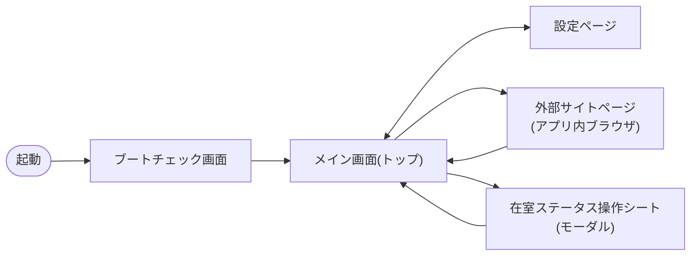

# 画面仕様

## 画面遷移

## ブートチェック画面(`BootCheckScreen`)

起動直後に以下のチェックを**並列に開始**し、結果は起動ログ風に時間差を付けて
一覧へ順次表示する。完了後にメイン画面へ進む。

ブラウザ単体実行では、カメラ(`getUserMedia`)と音声出力(Web Audio API)を
best-effort で検査し、ディスプレイは canvas の色描画だけを自己診断する。
Tauri / Rust バックエンドが必要な v4l2、実ディスプレイ情報、ONNX モデル、
ネットワーク情報、端末スペックの検査は省略する。サーバー接続チェック自体は
ブラウザでも省略せず、設定されたエンドポイントがある場合は開発用の HTTP 中継を
利用して検査する。

| チェック | 内容 |
|---|---|
| カメラ | 実機は v4l2 キャプチャ、ブラウザは getUserMedia の best-effort 確認 |
| 音声出力 | 出力デバイスと Web Audio API 再生パイプラインの確認 |
| ディスプレイ | 解像度・台数(Rust `get_display_info`)+ canvas 描画自己診断 |
| 顔認証・ジェスチャーモデル | `init_vision`(ONNX モデルロード) |
| サーバー接続 | メンバー一覧 API への疎通(Authorization 付き) |
| ネットワーク | IPv4 アドレス取得(リンクローカルは DHCP 未取得扱い) |
| サーバースペック | CPU / メモリ / ディスク情報の表示(合否判定なし) |

## メイン画面(トップ)

左右 2 分割のグリッド。全体に背景パターン(設定で変更可)を薄く敷く。

### 左: メンバー一覧パネル(`MemberListPanel`)

- メンバーをステータス順(在室 → 外出 → 帰宅)に並べて表示。
- レイアウトは設定で変更可能: グリッド(2列)/ コンパクト(3列)/ リスト(1列)。
- カードをタップすると在室ステータス操作シートを開く。
- 読み込み中はスケルトン、失敗時はエラーメッセージを表示。
- ヘッダー右に取得済み人数(`N online`)を表示。
- **顔登録モード中はここが登録フォーム(`FaceRegistrationForm`)へ差し替わる**。

### 右: 顔認証パネル(`FaceAuthPanel`)

- カメラ映像(ミラー表示)。顔枠・ランドマーク・手の骨格は Rust 側がフレームへ
  焼き込むため、フロントは映像を表示するだけ(→ [face-auth/face-recognition.md](../face-auth/face-recognition.md))。
- 顔登録モード中もカメラ・検出可視化は動き続け、上部に「カメラを見てください」を表示。
- 状態に応じたヒント表示: 「顔を画面に近づけてください」「もう少し近づいてください」
  「登録済みの顔と一致しませんでした」「登録済みの顔がありません」。
- 認識確定時は確認カード「◯◯さんですか?」(はい / ちがう)を表示。
  「はい」で操作シートへ。顔が離れると自動で閉じる。
- ヘッダー: 顔登録モード切替・テーマ切替・**外部サイト(地球儀)**・
  設定ページを開くボタン(この並び順)。
- 推論中インジケータ(inferring)を右上に表示。

## 外部サイトページ(`ExternalSitePage`)

- トップ画面ヘッダーの地球儀ボタンから開く、設定ページと同じ方式の
  フルスクリーンオーバーレイ(遅延読み込み)。
- 設定(API接続)の外部サイト一覧(`externalSites`)を**ランチャー**として
  カード表示し、選んだサイトをアプリ内ブラウザで開く。**1件だけ登録されて
  いる場合はランチャーを挟まず直接開く**。未登録なら設定手順を案内する。
- サイトごとに設定した **HTTP ヘッダー(認証トークン等)** を、ページ取得と
  リンク・フォーム遷移(サーバサイド経由の全リクエスト)へ付与する。
  CSS・画像などのサブリソースはブラウザが直接読むため対象外。
- **表示方式(サーバサイド取得型)**: iframe に URL を直接読み込ませると
  サイト側の X-Frame-Options / CSP(frame-ancestors)で拒否されるため、
  他の API と同じ通信経路(開発時=中継サーバ / 実機=Rust reqwest)で
  HTML を取得し、`<script>` と meta refresh を除去・`<base>` を注入してから
  同一オリジンの iframe(about:blank)へ `document.write` で描画する。
- **ページ内のリンク・フォームは横取り**して同じ経路で遷移する
  (GET リンク・GET/POST フォーム対応。ファイル送信・ページ内 JS は非対応)。
  ページ内アンカー(#)はその場でスクロール。非 HTML(PDF 等)は表示不可の案内。
- 文字コードは Content-Type ヘッダー → meta charset → UTF-8 の順で判定。
- ヘッダー: 閉じる・ページ履歴の戻る・ホーム(そのサイトの登録URL)・
  現在の URL・再読み込み・サイト一覧へ(2件以上登録時のみ)。
- CSS・画像・フォントは `<base>` を起点に元サイトから直接読み込む。
  このためアプリ CSP(tauri.conf.json)の style-src / img-src / font-src に
  `http: https:` を許可している。**script-src は 'self' のまま**
  (除去しそこねたスクリプトも実機では CSP で実行されない)。
- 表示中は顔認証ループ・人物不在時の減光を停止する(iframe 内の操作は
  window へ届かないため)。
- 制約: サイト側 JavaScript が必須な SPA、ログインセッション(Cookie)の
  維持、http:// サイトのサブリソース(mixed content 制限)は非対応または
  環境依存。うまく表示できない場合はサーバーレンダリングされたページを
  登録すること。

## 在室ステータス操作シート(`AttendanceActionSheet`)

- 選択メンバーの情報と、在室 / 外出 / 帰宅 の 3 ボタンを表示。
  現在のステータスは選択不可(「現在」表示)。
- 表示中はジェスチャー認識が動作し、下部にアイコン付きの案内を表示
  (→ [gesture/gesture-control.md](../gesture/gesture-control.md))。
- 更新成功時は完了表示を約 1.1 秒出して自動で閉じる。失敗時はエラーを表示。

## 顔認証の確認カード(`FaceMatchConfirmCard`)

- 「◯◯さんですか?」に対して次の3通りの操作ができる(接触・非接触の両経路):
  1. **クリック/タップで「はい」** → 在室ステータス操作シートへ進む
  2. **ジェスチャー(グー/チョキ/パー)をかざす** → 「はい」を押さずに
     その割り当てステータスで直接記録(完了表示後に自動で閉じる)
  3. **サムズダウン(👎)をかざす** → 「ちがう」として閉じる(設定で無効化可)
- ジェスチャー確定後は「はい / ちがう」の部分が**送信カウントダウン**
  (進捗リング+3→2→1 の数字アニメーション、`GestureCountdown`)に置き換わり、
  カウント完了で送信される。カウント中に手を下ろすとキャンセル。秒数は
  設定(ジェスチャー → 送信までのカウントダウン)で変更できる(0 で即時送信)。
  操作シートのジェスチャー操作でも同じカウントダウンが表示される。
- 下部にジェスチャーの案内を表示。表示時に確認音(confirmation)を再生する。

## システム状態フッター(`StatusFooter`)

- **全ページ**(起動チェック・トップ・設定)の最下部に常駐する高さ 28px のバー。
- CPU 使用率・メモリ使用率(ミニバー+数値)、ネットワーク IP、
  上り(▲)/下り(▼)の通信ランプ+転送レートをリアルタイム表示する。
- Rust の `get_system_stats` を 2 秒間隔でポーリング(sysinfo)。通信ランプは
  1KB/s 以上のトラフィックで点灯。ブラウザ単体実行ではプレースホルダー表示。

## 効果音

`shared/lib/uiSound.ts` の `playUiSound` を1本のIOとして呼ぶ。再生経路は
カメラと同じ方針で実行環境により分かれる:

- **実機(Tauri)**: Rust 側の `play_ui_sound` コマンド(`src-tauri/src/audio.rs`)で
  再生する。mp3 は**バイナリへ埋め込み**(public/sounds/ と同一ファイル、計約130KB)、
  デコードは symphonia、出力は cpal → ALSA(キオスクでは pipewire-alsa 経由)。
  WebKitGTK の HTMLAudioElement はカスタムスキームからのメディア取得や
  PipeWire 接続の問題で環境により無音になる(iMac 2013 + Debian 13 で確認)ため
  使わない。出力デバイスを開けない場合も動作は止めず、次回呼び出しで再試行する。
- **開発時(ブラウザ)**: `public/sounds/` の mp3 を標準の HTMLAudioElement で再生する。

| 音 | タイミング |
|---|---|
| click.mp3 | 押せるボタンのクリック(document 委譲で全画面共通) |
| hover.mp3 | ボタンへのホバー(同一ボタン内の移動では鳴らさない) |
| confirmation.mp3 | 確認ダイアログの表示(保存確認・電源操作確認・顔認証確認カード) |
| success.mp3 | 在室更新・顔登録・設定保存の成功 |
| error.mp3 | 上記の失敗 |

種類ごとの音量(hover は控えめ等)はフロントと Rust で同じ値を持つ。
全体の音量はソフトウェアではなくハードウェア音量設定(一般 → 音量)で調整する。

## 設定ページ(`SettingsPage`)

- フルスクリーン。左サイドバーでセクション切替(GitHub の設定画面風)。
- セクション: 一般 / デザイン / パフォーマンス / API接続 / APIボディ /
  ジェスチャー / ログ / システム。
- 保存は draft 一括方式。**保存した設定は再起動なしで即時反映される**。
  再起動が必要な項目(`restartPolicy.ts` に宣言。現在は無し)が変更された
  保存のみ、確認モーダル → 端末再起動となる。
- 例外(保存不要の即時反映): テーマ / UIスケール / 音量は操作した瞬間に
  設定へ書き込まれ端末に適用される。
- アクセントカラーは保存前でもライブプレビューされ、保存せず閉じると元に戻る。
  背景パターンはこのページには適用されず(常に静的グリッド)、選択肢の
  サムネイルでプレビューする。

## その他

- `ScreenDimmer`: 無操作が設定時間(分)続くと約 12 秒かけて暗転し、その後
  **DPMS でディスプレイを物理消灯**(発熱対策。バックライトごとオフ)。
  操作(タッチ・マウス・キー)または**人感復帰**(顔がカメラに大きく写ったら)で
  物理点灯して復帰し、無操作時間は測り直しになる。
- vision エラーバナー: 推論基盤のエラーを画面下部中央に表示。
- 電源操作(再起動 / シャットダウン / シェルに戻る)は設定 → システムに統合
  (旧 `SystemControlPanel` は廃止)。
